# LLM Context: DDL Benchmark Engine

Актуализировано: 2026-07-31. Документ описывает фактический код production-пути,
а не только целевую архитектуру. Перед изменением критических контрактов сверяйся
также с [`docs/ARCHITECTURE_AUDIT.md`](docs/ARCHITECTURE_AUDIT.md) и
[`docs/E2E_TEST_SCENARIOS.md`](docs/E2E_TEST_SCENARIOS.md). Целевое устройство,
clean-slate rewrite и multi-database plugin boundary описаны отдельно в
[`docs/TARGET_ARCHITECTURE_REFACTOR.md`](docs/TARGET_ARCHITECTURE_REFACTOR.md).

## 1. Идея и границы проекта

Проект ищет более выгодный DDL для таблиц ClickHouse на измеряемой нагрузке:

1. читает исходный DDL и метаданные таблицы;
2. строит кандидаты `ORDER BY`, типов, кодеков, `index_granularity` и skip-indexes;
3. создаёт временные таблицы-кандидаты;
4. копирует в них данные и измеряет `INSERT`, `SELECT` и размер;
5. сравнивает метрики с baseline исходной схемы;
6. вычисляет настраиваемый `score`;
7. сохраняет результаты, lineage и top-N в ClickHouse.

Движок не применяет найденный DDL к исходной таблице. Его выход — измерения и DDL
кандидата для последующего решения человеком или внешней системой. При этом запуск
не является read-only для кластера: worker создаёт и удаляет временные таблицы и
пишет служебные таблицы результатов.

Практическая реализация сейчас ClickHouse-specific, хотя orchestration отделена
контрактами от metadata/execution/storage adapters.

## 2. Фактическая runtime-архитектура

```mermaid
flowchart LR
    ENV["Base64 JSON + env"] --> MAIN["main.py\ncomposition root"]
    MAIN --> CFG["Pydantic models + ConfigLoader"]
    CFG --> PLAN["BenchmarkPlanner"]
    PLAN <-->|"DDL, tables, samples"| META["FetcherMetadataProvider\nsource ClickHouse"]
    PLAN --> ENGINE["BenchmarkEngine\nquery plan + VariantJob"]
    ENGINE --> RUNNER["BenchmarkRunner\nTableExecutionStrategy"]
    RUNNER --> ADAPTER["CeleryClickHouseExecutionAdapter"]
    ADAPTER -->|"source task; wait result"| MQ["RabbitMQ / Celery backend"]
    ADAPTER -->|"variant tasks; async"| MQ
    MQ --> WORKER["Celery worker tasks"]
    WORKER -->|"CREATE / INSERT / SELECT / DROP"| SOURCE["source + test ClickHouse"]
    WORKER --> STORE["ClickHouse result store"]
    STORE <-->|"dedup lock"| REDIS["Redis"]
    STORE -->|"summaries / top-N / resume"| RUNNER
```



Это модульный монолит в одном Python-репозитории, развёрнутый как минимум двумя
типами процессов:

- launcher: `main.py`;
- Celery worker: `src.benchmark_runtime.implementations.clickhouse_celery.tasks`.

RabbitMQ/Celery backend, Redis и ClickHouse — внешние обязательные runtime-компоненты.
`main.py` не запускает worker и не управляет его количеством.

## 3. Полный путь одного запуска

1. `settings.AppSettings` читает четыре обязательных base64 JSON-секции:
   `celery`, `connections`, `rule_banks`, `benchmarks`.
2. `ConfigLoader.parse_parts()` строит `BenchmarkRootConfig`, запрещает неизвестные
   поля в основных моделях и проверяет ссылки на connections/rule banks.
3. `main.py` выбирает result connection, создаёт ClickHouse result store, metadata
   providers, Celery adapter, planner, engine и runner.
4. `BenchmarkRunner.run()` до любых измерений валидирует все scoring expressions и
   материализует список `TableBenchmarkPlan`.
5. Runner выбирает или продолжает `benchmark_run_id`, затем для каждой таблицы
   синхронно запускает `SourceBenchmarkJob`.
6. Source worker создаёт UUID-именованную baseline-копию, делает повторные insert/select
   замеры, сохраняет baseline row и удаляет копию в `finally`.
7. Runner получает `SourceBenchmarkResult`, прикладывает его ко всем `VariantJob` и
   вызывает table execution strategy.
8. Variant worker создаёт candidate table, копирует данные, выполняет query plan,
   считает size/percentiles/speedups/score, сохраняет row и удаляет table в `finally`.
9. Top-N стратегии ставят барьеры между стадиями, читают summaries из store и строят
   следующие задания из победителей. Обычные стратегии только публикуют variant tasks.
10. Для phased-стратегии runner пишет table-level start/finish snapshot в
    `benchmark_runs`. Для legacy-стратегий этот store-hook намеренно no-op.

Baseline измеряется на копии исходного DDL, а не непосредственно на source table.
Повторы `INSERT` добавляют данные в одну временную таблицу без очистки между повторами.

## 4. Слои и ответственность

| Слой | Основные файлы | Ответственность |
|---|---|---|
| Конфигурация | `src/models.py`, `src/loader.py`, `settings.py` | Схема JSON/env, merge файлов, ссылочная валидация |
| DDL и правила | `src/clickhouse_ddl.py`, `src/resolver.py`, `src/*_rules.py` | Парсинг/рендер DDL, выбор применимых правил |
| Планирование | `TableSelector`, `QueryPlanBuilder`, `BenchmarkPlanner` в `src/benchmark_engine.py` | Выбор таблиц, global/table overrides, effective plan |
| Генерация | `src/variant_generation/`, facade `src/combiner.py` | Lazy generation DDL + `VariantMeta`, подсчёт вариантов |
| Оркестрация | `BenchmarkEngine`, `BenchmarkRunner`, `table_strategy/*` | Jobs, baseline, порядок стадий, top-N и resume |
| Порты | `src/benchmark_runtime/contracts/` | Metadata, execution, result store, run id, table strategy |
| Production adapters | `implementations/fetcher/`, `implementations/clickhouse_celery/` | ClickHouse metadata, Celery dispatch/worker, persistence |
| Тестовые adapters | `implementations/inmemory/`, `implementations/noop/` | Детерминированные unit/demo сценарии |

`src/benchmark_runtime/{execution,metadata,result_store,run_id,table_strategy}.py` и
`src/combiner.py` — backward-compatible re-exports/facades; новое поведение следует
добавлять в `contracts/` или `implementations/`, а не в wrappers.

## 5. Два независимых Strategy-механизма

### 5.1 JSON strategy -> внутренний generation mode

Пользователь задаёт `strategy`; planner выводит `mode` через `STRATEGY_TO_MODE`:

| Strategy | Generation mode | Синхронизация variant stage |
|---|---|---|
| `types_strategy` | `types` | fire-and-forget |
| `indexes_strategy` | `indexes` | fire-and-forget |
| `combined_strategy` | `combined` | fire-and-forget |
| `sequential_topn_strategy` | `sequential` | wait после types и indexes |
| `sequential_phased_topn_strategy` | `sequential` | wait после каждой фактической стадии |

`mode="sequential"` сам по себе не описывает порядок исполнения. Порядок задаёт
реализация `TableExecutionStrategy`.

### 5.2 Generation strategy

`src/variant_generation/registry.py` выбирает `VariantGenerationStrategy` для
`types`, `indexes`, `combined` или базовой sequential-генерации. Генератор не
исполняет SQL и не пишет результаты.

## 6. Sequential phased top-N

Концептуальные номера стадий используются в orchestration API и логах:

| № | `variant_mode` | Гранулярность | Результат стадии |
|---:|---|---|---|
| 0 | `source_baseline` | вся таблица | эталонные метрики |
| 1 | `order_by` | вся таблица | top ORDER BY branches |
| 2 | `types` | одна колонка | top type options per column |
| 3 | `codecs` | одна колонка | top `(type, codec)` options per column |
| 4 | `index_granularity` | merged full table | top full-table candidates |
| 5 | `indexes` | одна WHERE-колонка | top index options per column |
| 6 | `final_validation` | merged full table | финальный top-N + local search |

Важные свойства:

- ORDER BY branches ограничены отдельным hard limit и config top-N;
- types/codecs/indexes тестируются независимо по колонкам;
- indexes рассматриваются только для колонок, найденных в `WHERE`, и получают
  query subset для соответствующей колонки;
- фаза `index_granularity` объединяет column choices в полные схемы;
- `final_validation` всегда начинает с top-1 choices и может проверять одношаговые
  замены top-2/top-3 через `local_search`;
- `execution_uuid` связывает dispatched job с конкретной сохранённой строкой и
  защищает stage polling от устаревшего результата с тем же именем таблицы;
- кандидат с `score=None` проигрывает scored-кандидату; если scored-кандидатов нет,
  стратегия может использовать fallback.

Подробный алгоритмический контракт:
[`docs/SEQUENTIAL_PHASED_TOPN_PIPELINE_CONTRACT.md`](docs/SEQUENTIAL_PHASED_TOPN_PIPELINE_CONTRACT.md).

## 7. Runtime DTO и инварианты

DTO находятся в `src/benchmark_runtime/types.py` и являются frozen Pydantic models:

- `TableTarget`, `Query`, `QueryPlan`, `TableBenchmarkPlan`;
- `SourceBenchmarkJob`, `SourceBenchmarkResult`;
- `VariantJob`, `BenchmarkVariantResult`, `StoredBenchmarkResult`;
- `TopTypeVariant`, `StoredVariantSummary`.

Ключевые инварианты:

- один `runner.run()` использует общий `benchmark_run_id` и `benchmark_started_at`;
- runner проверяет identity baseline result: run, benchmark, source DB/table и timestamp;
- `VariantJob.source_database` — источник, `variant_database` — место временной таблицы;
- если `test_database` не задан, variants создаются в source database, а baseline —
  в `${source_database}__benchmark_tmp`;
- runner не сохраняет variant result: это обязанность execution backend/worker;
- top-N strategies требуют store с нужными read APIs;
- имя variant table детерминировано как
  `{source_table}__bench__{benchmark_id}__{global_index:04d}`.

Последний инвариант полезен для resume, но в текущем виде не изолирует параллельные
запуски; это P0 finding архитектурного аудита.

## 8. Конфигурация и effective overrides

`BenchmarkConfig` задаёт defaults, `TableRuleConfig` переопределяет их для конкретной
`database.table`. Planner вычисляет effective значения для:

- rules и rule bank modes;
- strategy/mode;
- queries и scoring;
- insert repetitions и row limits;
- candidate generation limits;
- sequential top-N/beam limits;
- index granularity и ORDER BY candidates;
- test database и column order.

Лимит строк одного variant insert выбирается так:

1. `insert_rows_per_operation_limits[variant_mode]`;
2. `insert_rows_per_operation_limits[job_mode]`;
3. `insert_rows_per_operation_limit`.

Для source baseline сначала проверяются `source_insert_rows_per_operation_limits` и
`source_insert_rows_per_operation_limit`, затем используются variant limits как fallback.

`max_benchmarks_limits` ограничивает число jobs по stage/mode. Если лимит отсутствует,
текущий fallback — `insert_operations_count`; эти два параметра семантически разные,
но пока связаны backward compatibility поведением.

Scoring поддерживает только `mode="expression"`. Доступны global expression,
переменные, `on_error_score`, направление `top_selection=max|min` и `by_stage`
overrides. Формулы проходят AST allow-list validation до старта и повторно
вычисляются worker-side на нормализованном context.

## 9. Query plan и измерения

Режимы query plan: `auto`, `manual`, `auto_with_manual`.

- manual queries поддерживают `{table}` и `{benchmark_id}` placeholders;
- auto queries генерируются преимущественно по measured columns;
- генератор поддерживает `LIKE` для строк и range filters для numeric/datetime, но
  текущий `QueryPlanBuilder._build_data_aware_range_tokens()` фактически возвращает
  `None`: его основное тело ошибочно находится после `return` соседнего метода;
  numeric/datetime auto-plan может поэтому остаться без ожидаемой SELECT-нагрузки
  (см. ARC-16 в аудите);
- при наличии metadata capability авто-запросы с `rows == 0` фильтруются;
- warm query выполняет query-level warmups перед каждым measured run;
- cold query добавляет `use_uncompressed_cache=0`;
- per-query metrics сохраняются по `query_id` в JSON;
- worker валидирует query payload как read-only, но защита основана на prefix +
  keyword deny-list и не заменяет ограниченную ClickHouse роль.

Основные метрики: elapsed time, rows/s, bytes/s, read rows/bytes, compressed sizes,
primary/skip index sizes, percentiles, speedup against source и итоговый score.

## 10. Persistence: фактическая схема

`ClickHouseBenchmarkResultStore` использует:

1. `BENCH_LEGACY_RESULT_TABLE` — результаты non-phased strategies;
2. `BENCH_PHASED_RESULT_TABLE` — компактные phased rows;
3. `BENCH_PHASED_RUNS_TABLE` — table-level lifecycle только phased strategy;
4. опциональную payload-offload table, которую создаёт execution adapter.

Phased result row содержит identity/lineage (`id`, `parent_id`, run/source fields),
worker metadata, `tested_table_ddl`, `variant_table`, `variant_mode`,
`variant_mode_id`, два представления variant params, compact JSON metrics, score,
quality и ranking fields.

Критично: актуальная phased table **не содержит** колонок `phase` и `phase_name`.
Store удаляет эти legacy-дубликаты при schema migration. Stage scope хранится в
`variant_mode`; дополнительное `phase_name` остаётся внутри `variant_params`.
Аргументы `phase` в store contract — compatibility API, которое преобразует номер
в `variant_mode`.

Пример выбора финального победителя:

```sql
SELECT tested_table_ddl, score, variant_params_json
FROM benchmark_results__phased
WHERE benchmark_run_id = 123
  AND benchmark_id = 'my_benchmark'
  AND source_db_name = 'analytics'
  AND source_table_name = 'events'
  AND variant_mode = 'final_validation'
  AND is_top_n = 1
ORDER BY rank_in_phase
LIMIT 1;
```

`benchmark_runs` хранит `id`, run/benchmark/source identity, timestamps,
`top_n_winners` и JSON с top-N/score selection settings. Переданные в
`register_benchmark_run_start()` source DDL, queries и row count сейчас не сохраняются.

Result `id` — SHA-256 от run/table/variant scope и execution token. Проверка
`exists -> insert` защищена process lock + Redis distributed lock. ClickHouse
MergeTree сам не обеспечивает unique constraint.

## 11. Lifecycle, resume и failure semantics

Эти особенности нельзя предполагать иначе при изменениях:

- source task синхронна для launcher; variant task возвращает только статус dispatch;
- regular strategies не ждут terminal state variant tasks перед возвратом из run;
- sequential strategies ждут Celery events, поэтому worker должен работать с `-E`;
- task failure считается завершением progress batch; phased стратегия затем проверяет
  наличие result summaries;
- worker старается сохранить failed variant row, но invalid payload до Pydantic parse
  возвращается как Celery success без result row;
- runner перехватывает exception phased table-plan, логирует и продолжает следующий
  table plan; process всё равно может вернуть success/run id;
- early return из phased strategy может пометить table plan finished даже без
  `final_validation` winner;
- resume проверяет `finished_at` в `benchmark_runs` и дедуплицирует jobs по
  `variant_table`; config/build fingerprint отсутствует;
- run id provider использует `max(existing) + 1` без distributed reservation;
- variant names не включают run id, поэтому concurrent runs одного benchmark/table
  используют одинаковые физические имена.

Полный список последствий и исправлений — в архитектурном аудите.

## 12. Entry points

- `main.py` — production composition root, env/base64 -> ClickHouse + Celery + Redis;
- `python -m celery -A src.benchmark_runtime.implementations.clickhouse_celery.tasks worker -E`
  — production worker (на практике используется executable `celery`);
- `examples/example.py` — in-memory dry-run общего pipeline;
- `examples/example_sequential_topn.py` — in-memory sequential demo;
- `validate_json_config.py` — проверка config shape/references;
- `validate_scoring_formula.py` — статическая проверка scoring;
- `recalculate_custom_score.py` — запись альтернативного `score_custom`.

## 13. Тесты и верификация

В репозитории 18 test modules и 359 `test_*` methods. Покрыты config, DDL parser,
rules/generation, planner/engine/runner, scoring, worker metrics, Celery adapter и
result-store через mocks/fakes.

Реального full-stack теста с ClickHouse + RabbitMQ + Redis + отдельным Celery worker
нет; нет также CI workflow и общего compose для E2E. Поэтому unit green не доказывает
корректность lifecycle, redelivery, distributed lock, concurrent runs и cleanup.

Обычный запуск:

```bash
python -m pytest -q
```

На момент синхронизации текущий системный Python не содержит project dependencies
(`pydantic`, `pytest`), поэтому число 359 — статически обнаруженные тесты, а не
утверждение о последнем успешном прогоне.

## 14. Как расширять без нарушения границ

Новый generation mode:

1. реализовать `VariantGenerationStrategy`;
2. зарегистрировать его в `variant_generation.registry`;
3. при доступности из JSON расширить literals и `STRATEGY_TO_MODE`;
4. добавить count/iteration equivalence tests.

Новая table strategy:

1. реализовать `TableExecutionStrategy`;
2. зарегистрировать её в `BenchmarkRunner`;
3. явно определить terminal condition, result-store requirements и resume identity;
4. не полагаться на private runner methods в новом публичном контракте.

Новый backend:

1. реализовать contracts metadata/execution/result store/run id;
2. гарантировать baseline-before-variants;
3. определить, где сохраняется terminal result;
4. проверить idempotency, cleanup и failure propagation E2E.

## 15. Чек-лист перед изменением

1. Определи, меняется config contract, generation или orchestration strategy.
2. Проверь оба result schemas и worker payload schema.
3. Не путай conceptual phase с физической колонкой: фильтруй по `variant_mode`.
4. Сохрани baseline identity и worker-side persistence.
5. Проверь обычный запуск, phased stage barrier, resume и concurrent run isolation.
6. Не добавляй credentials в логи/ошибки.
7. Обнови README, этот файл и pipeline contract при изменении поведения.
8. Прогони unit tests и подходящий E2E tier из каталога сценариев.

## 16. Связанные документы

- [`README.md`](README.md) — эксплуатация и конфигурация;
- [`docs/SEQUENTIAL_PHASED_TOPN_PIPELINE_CONTRACT.md`](docs/SEQUENTIAL_PHASED_TOPN_PIPELINE_CONTRACT.md) — точный phased algorithm;
- [`docs/ARCHITECTURE_AUDIT.md`](docs/ARCHITECTURE_AUDIT.md) — findings и roadmap;
- [`docs/TARGET_ARCHITECTURE_REFACTOR.md`](docs/TARGET_ARCHITECTURE_REFACTOR.md) — clean-slate/multi-DB target RFC;
- [`docs/E2E_TEST_SCENARIOS.md`](docs/E2E_TEST_SCENARIOS.md) — full-path test matrix;
- [`BENCHMARK_RUN_EXAMPLES.md`](BENCHMARK_RUN_EXAMPLES.md) — примеры запуска.
