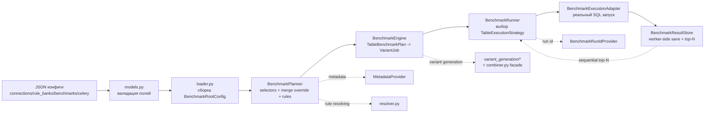

# DDL Benchmark Engine

Инструмент для автоматического DDL-бенчмарка: перебирает варианты схемы таблиц (типы, кодеки, индексы), запускает тестовые запросы и помогает выбрать лучший вариант по `score`.

Важно: текущий `main.py` — это demo-runner (in-memory таблицы + `NoopExecutionAdapter`).
Для реального прогона на вашем ClickHouse нужен рабочий `BenchmarkExecutionAdapter`.

## Оглавление

- [Что это и кому полезно](#what)
- [Что подаём на вход и что получаем на выход](#io)
- [Алгоритм работы бенчмарка](#algorithm)
- [Слои системы (человеческим языком)](#layers)
- [Чек-лист перед первым запуском](#checklist)
- [Быстрый старт](#quick-start)
- [Как собрать конфиг под свой ClickHouse](#clickhouse-config)
- [Как запустить бенчмарк](#run)
- [Валидация JSON-конфигов](#validation)
- [Мини-справочник по полям JSON](#json-reference)
- [Частые ошибки](#faq)
- [Для разработчиков (технические детали)](#dev)

<a id="what"></a>
## Что это и кому полезно

Этот проект нужен, если вы хотите не “на глаз” выбирать DDL, а сравнивать варианты на реальных запросах.

Что делает:
1. Берёт ваши правила мутаций DDL (типы/кодеки/индексы).
2. Генерирует варианты схемы.
3. Гоняет одни и те же запросы на каждом варианте.
4. Сохраняет результаты и score.
5. Позволяет выбрать лучший вариант на основе замеров.

<a id="io"></a>
## Что подаём на вход и что получаем на выход

На вход:
1. Конфиги подключения к БД.
2. Какие БД/таблицы бенчмаркить.
3. Какие правила перебора применяем.
4. Какой режим перебора (`types`, `indexes`, `combined`, `sequential`).
5. Какие запросы запускать.

На выход:
1. `benchmark_run_id` одного запуска.
2. Результаты по каждому варианту (через result store).
3. Возможность взять топ-варианты по score.

<a id="algorithm"></a>
## Алгоритм работы бенчмарка

1. Загружается JSON-конфиг и валидируется.
2. Из настроек `databases`/`tables` строится список целевых таблиц.
3. Для каждой таблицы применяются global + table override.
4. Резолвятся правила из `rule_banks` и inline-правила.
5. Строится `TableBenchmarkPlan`.
6. Генерируются DDL-варианты и `VariantJob`.
7. Каждый job выполняется через `BenchmarkExecutionAdapter`.
8. `BenchmarkExecutionAdapter`/воркер сохраняет результат в `BenchmarkResultStore`.

Если режим `sequential`:
1. Сначала гоняются варианты `types`.
2. По score выбираются top-N (`sequential_top_n`).
3. Только для top-N запускаются варианты `indexes`.

Лимиты вставки строк (`insert_rows_limit`/`insert_rows_limits`) применяются по приоритету:
1. `insert_rows_limits[variant_meta.mode]`
2. `insert_rows_limits[job.mode]`
3. `insert_rows_limit`

<a id="layers"></a>
## Слои системы (человеческим языком)

Ниже не “академическая архитектура”, а реальный путь данных от JSON до результата.

### Визуальная схема потока



### Слои по порядку

1. Контракт конфигов (`src/models.py`).
Что это:
Это «правила формы» для JSON. Здесь заранее описано, какие поля вообще разрешены и какие значения считаются корректными.
Зачем это нужно:
Чтобы поймать ошибки сразу на старте, а не посреди запуска бенчмарка.
Что приходит:
Сырые JSON-данные.
Что уходит:
Проверенные Python-объекты (`BenchmarkConfig`, `BenchmarkRootConfig` и т.д.).

2. Сборка root-конфига (`src/loader.py`, `validate_json_config.py`).
Что это:
Слой, который собирает конфиг из частей (`connections`, `rule_banks`, `benchmarks`, `celery`) в один общий объект.
Зачем это нужно:
Чтобы проект работал как с одним файлом, так и с несколькими файлами, и чтобы ссылки между секциями были валидны.
Что приходит:
JSON-секции или `benchmark.project.json`.
Что уходит:
Единый `BenchmarkRootConfig`, готовый к планированию.

3. Резолв правил (`src/resolver.py`).
Что это:
Логика, которая решает, какие именно правила применять к таблице: глобальные, локальные, из банка правил или inline.
Зачем это нужно:
Чтобы не было конфликтов и двусмысленности в правилах мутации DDL.
Что приходит:
`global_rules`, `table_rules`, `rule_bank`/`default_rule_banks`.
Что уходит:
`ResolvedRules` с итоговыми `column_rules`, `index_rules`, `column_order`.

4. Метаданные (`src/benchmark_runtime/contracts/metadata.py` + реализации).
Что это:
Абстракция над источником БД-метаданных.
Зачем это нужно:
Движок не привязывается к одному клиенту БД и может брать DDL/списки таблиц из разных реализаций.
Что приходит:
`connection_id`, `database`, `table`.
Что уходит:
Список БД/таблиц, исходный `TableDDL`, размеры колонок (если поддерживается).

5. Планирование таблиц (`TableSelector`, `BenchmarkPlanner` в `src/benchmark_engine.py`).
Что это:
Слой, который превращает «общие пожелания» из конфига в конкретные планы по каждой таблице.
Зачем это нужно:
Чтобы runner работал уже с точными, детерминированными задачами.
Что приходит:
`BenchmarkRootConfig` + metadata provider.
Что уходит:
Поток `TableBenchmarkPlan` (один план на одну таблицу).

6. Генерация DDL-вариантов (`src/variant_generation/*`, фасад `src/combiner.py`).
Что это:
Слой перебора схемы: создает версии таблицы с разными типами/кодеками/индексами.
Зачем это нужно:
Именно тут рождаются кандидаты, которые потом сравниваются по производительности.
Что приходит:
Исходный `TableDDL`, правила и внутренний `mode`.
Что уходит:
Пары `(variant_ddl, VariantMeta)` и оценка количества вариантов (`total_variants`).

7. Подготовка execution jobs (`BenchmarkEngine`).
Что это:
Преобразователь «DDL-вариантов» в конкретные задания на запуск.
Зачем это нужно:
Чтобы адаптеру исполнения передавать уже полностью готовый job.
Что приходит:
`TableBenchmarkPlan`, варианты DDL, query-настройки.
Что уходит:
`VariantJob` с SQL-запросами, именем variant-таблицы и итоговым `insert_rows_limit`.

8. Оркестрация выполнения (`BenchmarkRunner` + `TableExecutionStrategy`).
Что это:
Координатор всего запуска.
Зачем это нужно:
Он выбирает стратегию исполнения по `benchmark.strategy` и определяет порядок запуска вариантов.
Что приходит:
`TableBenchmarkPlan`.
Что уходит:
Вызовы в execution adapter.
Важно:
Для `sequential_topn_strategy` runner делает 2 этапа: сначала `types`, потом `indexes` только для top-N.
`result_store` в `BenchmarkRunner` теперь опционален, но для top-N стратегий обязателен
(`sequential_topn_strategy`, `sequential_topn_stage2_dispatch_strategy`).
Runner не пишет результаты в store. Сохранение выполняет execution backend (обычно Celery-воркер).
`sequential_topn_strategy` внутри себя ставит wait-барьер: ждёт, пока в store появятся все результаты type-stage,
и только потом выбирает top-N и запускает index-stage.
Если нужен fire-and-forget через Celery (launcher не ждёт), используйте:
- `sequential_topn_stage1_dispatch_strategy` — отправляет только types-stage.
- `sequential_topn_stage2_dispatch_strategy` — читает top-N types из store и отправляет indexes-stage.
Практический порядок запуска:
1. Запускаете benchmark со `strategy=sequential_topn_stage1_dispatch_strategy`.
2. Внешний процесс дожидается завершения всех type-задач и записи результатов воркерами.
3. Повторно запускаете тот же benchmark (тот же `benchmark_id` и `benchmark_run_id`), но со `strategy=sequential_topn_stage2_dispatch_strategy`.

9. Фактическое выполнение SQL (`BenchmarkExecutionAdapter`).
Что это:
Точка, где реально выполняется SQL в БД.
Зачем это нужно:
Ядро не знает, как именно запускать SQL в вашем окружении; это инкапсулируется адаптером.
Что приходит:
`VariantJob`.
Что уходит:
`BenchmarkVariantResult` (score и дополнительные метрики в payload).

10. Хранилище результатов (`BenchmarkResultStore`).
Что это:
Слой сохранения и чтения результатов.
Зачем это нужно:
Результаты не держатся «кучей» в памяти и доступны для отборов top-N.
Что приходит:
`VariantJob` + `BenchmarkVariantResult`.
Что уходит:
Сохраненные записи и выборки top type-вариантов.

11. Управление run-id (`BenchmarkRunIdProvider`).
Что это:
Источник идентификатора запуска бенчмарка.
Зачем это нужно:
Чтобы все результаты одного запуска имели общий `benchmark_run_id` и легко группировались.
Что приходит:
Сигнал нового запуска.
Что уходит:
Следующий корректный `benchmark_run_id`.

### Главное о границах ответственности

1. `variant_generation`/`combiner` только генерирует варианты, не исполняет их.
2. `BenchmarkRunner` управляет порядком исполнения и sequential top-N.
3. Контракты и реализации разделены: `contracts/` и `implementations/`.

<a id="checklist"></a>
## Чек-лист перед первым запуском

1. В `connections.json` есть нужный `connection_id`.
2. В `benchmarks.json` этот `connection_id` указан в каждом benchmark.
3. Если используете `rule_bank`, он реально существует в `rule_banks.json`.
4. Если `queries.mode = "manual"`, в `test_queries` есть хотя бы один запрос.
5. Конфиги проходят валидацию через `validate_json_config.py`.

<a id="quick-start"></a>
## Быстрый старт

### 1) Проверка окружения

```bash
./venv/bin/python -V
./venv/bin/python -m pytest -q
```

### 2) Валидация примерных конфигов

```bash
./venv/bin/python validate_json_config.py parts \
  --celery-path configs/celery.example.json \
  --connections-path configs/connections.example.json \
  --rule-banks-path configs/rule_banks.example.json \
  --benchmarks-path configs/benchmarks.example.json
```

### 3) Запуск demo

Сделай шаги из раздела [Как запустить бенчмарк](#run), вариант A.

<a id="clickhouse-config"></a>
## Как собрать конфиг под свой ClickHouse

Ниже минимальный, рабочий сценарий.

### Шаг 1. `connections.local.json`

```json
{
  "connections": [
    {
      "id": "prod_ch",
      "dbms": "clickhouse",
      "credential_type": "password",
      "host": "clickhouse.my-host.local",
      "port": 9000,
      "login": "bench_user",
      "password": "secret"
    }
  ]
}
```

### Шаг 2. `rule_banks.local.json`

Вариант 1 (самый быстрый): взять готовый baseline и не писать большой банк с нуля.

```json
{
  "rule_banks": {
    "baseline": {
      "column_rules": [
        {
          "by_type": "UInt64",
          "types": ["UInt64", "UInt32"],
          "codecs": ["CODEC(Delta(8), LZ4)", "CODEC(T64, ZSTD(1))"]
        }
      ],
      "index_rules": [
        {
          "by_type": "UInt64",
          "indexes": [
            {"type": "minmax", "granularity": 4},
            {"type": "bloom_filter(0.01)", "granularity": 2}
          ]
        }
      ]
    }
  },
  "default_rule_banks": {
    "clickhouse": "baseline"
  }
}
```

### Шаг 3. `benchmarks.local.json`

```json
{
  "benchmarks": [
    {
      "id": "bench_seq",
      "connection_id": "prod_ch",
      "strategy": "sequential_topn_strategy",
      "databases": ["analytics"],
      "tables": ["events"],
      "max_iterations": 20,
      "sequential_top_n": 2,
      "insert_rows_limit": 1000000,
      "insert_rows_limits": {
        "types": 800000,
        "indexes": 300000,
        "sequential": 500000
      },
      "global_rules": {
        "rule_bank": "baseline"
      },
      "queries": {
        "mode": "manual",
        "test_queries": [
          {
            "query": "SELECT count() FROM {table}",
            "weight": 1.0
          }
        ]
      }
    }
  ]
}
```

### Шаг 4. `celery.local.json`

```json
{
  "workers": 4,
  "threads_per_worker": 2
}
```

<a id="run"></a>
## Как запустить бенчмарк

### Вариант A. Через текущий `main.py` (env-mode)

1. Укажи пути в `encode_configs_base64.py`:
- `CELERY_JSON_PATH`
- `CONNECTIONS_JSON_PATH`
- `RULE_BANKS_JSON_PATH`
- `BENCHMARKS_JSON_PATH`

2. Сгенерируй `.env`:

```bash
./venv/bin/python encode_configs_base64.py | sed 's/^export //' > .env
```

3. Запусти:

```bash
./venv/bin/python main.py
```

Важно: это demo-runner (без реального SQL execution).

### Вариант B. File-mode через project JSON

Создай `configs/benchmark.project.local.json`:

```json
{
  "connections_file": "connections.local.json",
  "rule_banks_file": "rule_banks.local.json",
  "benchmarks_file": "benchmarks.local.json",
  "celery": {
    "workers": 4,
    "threads_per_worker": 2
  }
}
```

Проверка:

```bash
./venv/bin/python validate_json_config.py project --path configs/benchmark.project.local.json
```

Использование в коде:

```python
from loader import load_config

config = load_config("configs/benchmark.project.local.json")
```

### Вариант C. Реальный запуск на своём ClickHouse

Для реального прогона нужны 3 вещи:
1. `MetadataProvider`, который читает реальные таблицы из ClickHouse.
2. `BenchmarkExecutionAdapter`, который реально создаёт variant-таблицы, вставляет данные, гоняет warmup/test SQL и считает score.
3. `BenchmarkResultStore` (обычно DB-backed), куда сохраняются результаты.

Примечание:
1. Реальные интерфейсы лежат в `src/benchmark_runtime/contracts/*`.
2. Встроенные реализации лежат в `src/benchmark_runtime/implementations/*`.
3. Импорт через `benchmark_engine` сохранён для обратной совместимости.

Минимальный шаблон:

```python
from loader import load_config
from benchmark_engine import (
    BenchmarkPlanner,
    BenchmarkEngine,
    BenchmarkRunner,
    FetcherMetadataProvider,
)
from fetcher import make_fetcher

config = load_config("configs/benchmark.project.local.json")
connection = next(c for c in config.connections if c.id == "prod_ch")
fetcher = make_fetcher(connection)

provider = FetcherMetadataProvider(fetcher)
planner = BenchmarkPlanner(config=config, providers_by_connection_id={"prod_ch": provider})
engine = BenchmarkEngine(planner=planner)

runner = BenchmarkRunner(
    engine=engine,
    execution_adapter=YourClickHouseExecutionAdapter(fetcher),  # реализуете сами
    result_store=YourResultStore(),  # реализуете сами
)
run_id = runner.run()
print(run_id)
```

Если нужен быстрый ориентир по структуре адаптера, посмотри:
- `examples/example.py`
- `examples/example_sequential_topn.py`
- `synthetic_interface_playground.py` (синтетический отладочный playground с примерными реализациями интерфейсов)

<a id="validation"></a>
## Валидация JSON-конфигов

Утилита: `validate_json_config.py`.

### Проверить один файл

```bash
./venv/bin/python validate_json_config.py single --type celery --path configs/celery.example.json
./venv/bin/python validate_json_config.py single --type connections --path configs/connections.example.json
./venv/bin/python validate_json_config.py single --type rule_banks --path configs/rule_banks.example.json
./venv/bin/python validate_json_config.py single --type benchmarks --path configs/benchmarks.example.json
./venv/bin/python validate_json_config.py single --type project --path configs/benchmark.project.example.json
```

Поддерживаемые `--type`:
- `celery`
- `connections`
- `rule_banks`
- `benchmarks`
- `project`
- `root`

### Проверить все 4 секции сразу + ссылки

```bash
./venv/bin/python validate_json_config.py parts \
  --celery-path configs/celery.example.json \
  --connections-path configs/connections.example.json \
  --rule-banks-path configs/rule_banks.example.json \
  --benchmarks-path configs/benchmarks.example.json
```

Коды завершения:
- `0` — всё хорошо.
- `1` — ошибка валидации/JSON/ссылок.

<a id="json-reference"></a>
## Мини-справочник по полям JSON

Это короткая версия справочника.
Если нужен полный пример со всеми важными полями, смотри:
- `configs/benchmarks.full_fields.example.json`
- `configs/benchmark.project.sequential_topn.example.json`

### `celery.json`

- `workers` (`int > 0`, default `4`)
- `threads_per_worker` (`int > 0`, default `2`)

### `connections.json`

Корень:
- `connections`: список подключений.

Подключение:
- `id` (уникальный id)
- `dbms` (обычно `clickhouse`)
- `credential_type` (обычно `password`)
- `host`, `port`, `login`, `password`

### `rule_banks.json`

Корень:
- `rule_banks`: словарь банков правил
- `default_rule_banks`: дефолтный банк по DBMS

`rule_banks.<bank_id>`:
- `column_rules`
- `index_rules`
- `column_order`

### `benchmarks.json`

Корень:
- `benchmarks`: список benchmark-конфигов.

Главные поля benchmark:
- `id`, `connection_id`, `strategy`
- `databases`, `tables`
- `global_rules`, `table_rules`
- `max_iterations`, `sequential_top_n`
- `insert_rows_limit`, `insert_rows_limits`
- `queries`
- `column_rules_mode`, `index_rules_mode`

`strategy`:
- `types_strategy`
- `indexes_strategy`
- `combined_strategy`
- `sequential_topn_strategy`
- `sequential_topn_stage1_dispatch_strategy`
- `sequential_topn_stage2_dispatch_strategy`

`queries.mode`:
- `auto`
- `manual`
- `auto_with_manual`

### `benchmark.project.json`

- `connections_file`
- `rule_banks_file`
- ровно одно из:
  - `benchmarks` (inline),
  - `benchmarks_file`
- `celery`

<a id="faq"></a>
## Частые ошибки

1. `connection_id ... не найден в connections`.
Проверь совпадение `benchmarks[].connection_id` и `connections[].id`.

2. `rule_bank ... не найден в rule_banks`.
Проверь `global_rules.rule_bank` и `table_rules[].rules.rule_bank`.

3. `mode=manual требует хотя бы одного test_query`.
Добавь `queries.test_queries`.

4. JSON parse error (`Expecting value`, `Expecting property name`).
Обычно это лишняя запятая или комментарий в JSON.

5. В `sequential` нет этапа индексов.
Проверь, что есть `index_rules`, `sequential_top_n > 0`, и адаптер возвращает `score`.
Если используете dispatch-стратегии, проверь, что после `sequential_topn_stage1_dispatch_strategy`
внешний процесс действительно дождался завершения всех type-задач и только потом запускает
`sequential_topn_stage2_dispatch_strategy` с тем же `benchmark_run_id`.

6. Включён `global_bank_only`, но нет доступного bank.
Либо укажи `global_rules.rule_bank`, либо настрой `default_rule_banks` для своего DBMS.

<a id="dev"></a>
## Для разработчиков (технические детали)

### Как это работает внутри

Если коротко, ядро построено как `planner -> engine -> runner`.

1. `loader` + `models` валидируют JSON и собирают `BenchmarkRootConfig`.
2. `BenchmarkPlanner` раскрывает селекторы БД/таблиц и строит `TableBenchmarkPlan`.
3. `BenchmarkEngine` на основе плана генерирует варианты DDL и превращает их в `VariantJob`.
4. `BenchmarkRunner` выполняет jobs через `BenchmarkExecutionAdapter`.
5. Сохранение результата делает execution backend/воркер в `BenchmarkResultStore`.

Где лежат runtime-контракты:
1. Интерфейсы: `src/benchmark_runtime/contracts/*`.
2. Реализации: `src/benchmark_runtime/implementations/*`.
3. In-memory реализации: `src/benchmark_runtime/implementations/inmemory/*`.
4. Runtime DTO (`VariantJob`, `TableBenchmarkPlan`, `BenchmarkVariantResult`) — `src/benchmark_runtime/types.py`.
5. Файлы `src/benchmark_runtime/execution.py`, `metadata.py`, `result_store.py`, `run_id.py`, `table_strategy.py` оставлены как совместимые re-export.

Почему это удобно:
1. Можно менять способ генерации вариантов отдельно от способа выполнения.
2. Можно подключать свой storage без изменений planner/engine.
3. Логику `sequential` можно развивать независимо от остальных режимов.

### Как расширять функционал

#### 1) Добавить новый режим генерации вариантов

1. Реализуйте `VariantGenerationStrategy` в `src/variant_generation/contracts/strategy.py`.
2. Зарегистрируйте стратегию через `register_variant_generation_strategy("my_mode", strategy)`.
3. Размещать built-in реализации удобно в `src/variant_generation/implementations/`.
4. Если новый mode должен приходить из JSON-стратегии, добавьте соответствующий ключ в `BenchmarkStrategy` и маппинг `STRATEGY_TO_MODE` в `src/models.py`.

#### 2) Добавить особую логику выполнения strategy

1. Реализуйте `TableExecutionStrategy`.
2. Подключите через `runner.register_table_execution_strategy("my_strategy", strategy)`.
3. Класс удобно размещать в `src/benchmark_runtime/implementations/table_strategy/`.

Это нужно, если режим выполняется не просто “прогнать все варианты подряд”, как в `sequential_topn_strategy`.

#### 3) Подключить реальный SQL-бенчмарк

1. Реализуйте `BenchmarkExecutionAdapter`.
2. Класс удобно размещать в `src/benchmark_runtime/implementations/` (например, отдельный подпакет `clickhouse/`).
3. Внутри `execute_variant(job)` обычно делаются:
   - создание variant-таблицы;
   - `INSERT INTO ... SELECT ...` (с учётом `job.insert_rows_limit`);
   - warmup-запросы;
   - test-запросы;
   - расчёт итогового `score`;
   - сохранение результата в `BenchmarkResultStore` (обычно из воркера);
   - очистка временных таблиц.

#### 4) Подключить реальный источник метаданных

1. Используйте `MetadataProvider` интерфейс.
2. Для ClickHouse можно взять `FetcherMetadataProvider` + `make_fetcher(...)`.
3. Свои реализации удобно размещать в `src/benchmark_runtime/implementations/`.

#### 5) Подключить production-хранилище результатов

1. Реализуйте `BenchmarkResultStore`.
2. Обязательные методы:
   - `store_result(job, result)`;
   - `get_top_type_variants(...)` (критично для `sequential`).
3. Свои реализации удобно размещать в `src/benchmark_runtime/implementations/` (например, подпапка `db/`).

### В каком файле что искать

1. `src/models.py` — контракт JSON (все поля и валидации).
2. `src/loader.py` — сборка конфига и проверка ссылок между секциями.
3. `src/benchmark_engine.py` — planner/engine/runner (оркестрация).
4. `src/benchmark_runtime/contracts/` — все runtime интерфейсы.
5. `src/benchmark_runtime/implementations/inmemory/` — in-memory реализации (`result_store`, `run_id`).
6. `src/benchmark_runtime/implementations/noop/` — `NoopExecutionAdapter`.
7. `src/benchmark_runtime/implementations/fetcher/` — `FetcherMetadataProvider`.
8. `src/benchmark_runtime/implementations/run_id/` — `MaxIdBenchmarkRunIdProvider`.
9. `src/benchmark_runtime/implementations/table_strategy/` — built-in стратегии выполнения.
10. `src/benchmark_runtime/types.py` — runtime DTO для planner/engine/runner.
11. `src/variant_generation/contracts/` — контракт генерации вариантов.
12. `src/variant_generation/implementations/` — built-in стратегии генерации (`types/indexes/combined/sequential`).
13. `src/variant_generation/registry.py` — реестр стратегий генерации.
14. `src/combiner.py` — backward-compatible фасад над `variant_generation`.
15. `src/fetcher.py` — ClickHouse-fetcher.
16. `validate_json_config.py` — CLI-валидатор JSON по пути.
17. `configs/*.example.json` — примеры конфигов.
18. `LLM_CONTEXT.md` — подробный технический контекст для LLM-агентов.

### Что проверить после изменений

```bash
# Полный тест-ран
./venv/bin/python -m pytest -q

# Тесты валидатора конфигов
./venv/bin/python -m pytest tests/test_validate_json_config.py -q

# Проверка JSON-синтаксиса конкретного файла
./venv/bin/python -m json.tool configs/benchmarks.example.json >/dev/null
```
