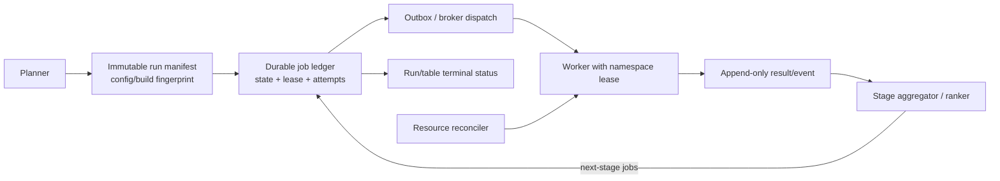

# Архитектурный аудит DDL Benchmark Engine

Дата: 2026-07-31

Тип: полный статический аудит репозитория и production execution path
Ограничение: инфраструктурный прогон не выполнялся; в системном `python3` отсутствуют
project dependencies (`pydantic`, `pytest`), а в репозитории нет готового full-stack
test environment.

## 1. Резюме

У проекта здравая базовая декомпозиция: строгий config contract, отдельные planner,
generation и orchestration, порты для metadata/execution/storage, immutable runtime
DTO, безопасный evaluator score и хороший объём unit/component-like тестов.

Основная проблема лежит не внутри генерации DDL, а на границе распределённого
lifecycle. Код эволюционировал из синхронного движка в Celery runtime, но не получил
полноценную модель job ownership и terminal state. В результате:

- параллельные или повторные execution могут использовать одну physical table;
- `run_id` выделяется гонкой `max + 1`;
- launcher может сообщить completion до появления результатов или после скрытой
  ошибки phased table;
- resume видит persisted rows, но не queued/running jobs и не проверяет config drift;
- schema migration и ClickHouse ranking mutations выполняются в worker hot path;
- task payload переносит реальные credentials и доверенный исполняемый DDL.
- DDL-копирование не ограничивает `ReplicatedMergeTree`/`ON CLUSTER`, а выборка данных
  для baseline и variants не закреплена одним immutable sample;
- data-aware range path для numeric/datetime сейчас содержит недостижимый код.

Вывод: архитектура подходит для контролируемого одиночного экспериментального
запуска, но конкурентный и полностью автоматический production запуск небезопасен до
закрытия P0 findings. Исходную таблицу код напрямую не мигрирует, однако отсутствие
run isolation может повреждать временные измерения и создавать нагрузку/объекты в
source database.

## 2. Охват и метод

Проверены:

- `main.py`, env settings и config loader/models;
- selector, planner, query builder, engine и runner;
- все generation/table execution strategies;
- Celery adapter, event monitor и worker tasks;
- ClickHouse result store, schema lifecycle, ranking, Redis lock и resume;
- naming, scoring, cleanup и security guards;
- 18 test modules / 359 test methods;
- README, LLM context, examples и phased contract.

Оценивались correctness, reliability, concurrency, security, scalability,
maintainability, observability, testability и operability. Findings ниже основаны на
конкретных control/data flows; предположения помечены как целевое поведение.

### 2.1 Уровни серьёзности

- **Critical** — возможны взаимное разрушение concurrent executions или неверные
  результаты без надёжного containment.
- **High** — ложный success, потеря/смешивание работы, security boundary или крупный
  production bottleneck.
- **Medium** — существенный operational/maintenance risk с обходным процессом.
- **Low** — локальный долг, drift или неоднозначность без немедленной потери данных.

## 3. Сильные стороны

1. **Явный config contract.** Pydantic models запрещают лишние поля, нормализуют
   значения и проверяют ссылки до runtime (`src/models.py`, `src/loader.py`).
2. **Хорошие application boundaries.** Metadata, execution, store, run ID и table
   strategy представлены интерфейсами в `src/benchmark_runtime/contracts/`.
3. **Разделение plan и effect.** DDL generation не выполняет SQL; engine строит jobs,
   worker владеет physical benchmark и persistence.
4. **Baseline как обязательный context.** Runner запускает source benchmark первым и
   валидирует identity результата перед variants.
5. **Безопасный scoring evaluator.** Формулы имеют AST allow-list, preflight validation,
   finite/error policy и stage overrides.
6. **Cleanup в обычных exception paths.** Baseline/variant tables и clients закрываются
   в `finally`; drop ограничен marker-именами.
7. **Lineage и correlation.** `parent_id`, variant params и `execution_uuid` позволяют
   восстановить phased chain и отсеять stale result при polling.
8. **Продуманная метрическая модель.** Есть per-query metrics, percentiles, source/tested
   ratios, size/index measurements и сохраняемый calculation context.
9. **Широкое unit-покрытие.** 359 tests проверяют большую часть pure logic и множество
   worker edge cases.

## 4. Карта компонентов и границ доверия

| Компонент | Владеет | Не должен владеть |
|---|---|---|
| Config/loader | shape и ссылки | SQL execution |
| Planner | effective table plan | physical resources |
| Variant generation | candidate DDL + metadata | score/top-N/storage |
| Runner/table strategy | порядок, barriers, selection | worker SQL и row persistence |
| Celery adapter | serialization, durable dispatch, source result wait | benchmark calculations |
| Worker | temp table lifecycle, measurements, score | global run allocation |
| Result store | durable results, rankings, run snapshots | schema migration orchestration в каждой task |
| Redis | distributed coordination | единственный источник run/job truth |

Фактически две границы доверия особенно важны:

1. launcher -> broker -> worker: payload содержит credentials, database names и DDL;
2. worker -> ClickHouse: одна task получает права читать source, создавать/удалять test
   objects и писать results.

## 5. Findings

IDs стабильны для ссылок и не отсортированы по серьёзности после расширения аудита.

| Severity | Findings |
|---|---|
| Critical | ARC-01, ARC-16, ARC-17, ARC-18 |
| High | ARC-02…ARC-07, ARC-19…ARC-21 |
| Medium | ARC-08…ARC-13, ARC-22 |
| Low | ARC-14, ARC-15 |

### ARC-01 — Critical — Physical variant tables не изолированы по run

**Доказательство.** `src/naming.py:variant_table_name()` строит имя только из source
table, lossy-sanitized benchmark ID и global index. Разные IDs вроде `bench-a` и
`bench_a` могут схлопнуться. `BenchmarkEngine.build_variant_job()` не добавляет
`benchmark_run_id` или execution UUID. `run_variant_benchmark()` перед CREATE и в
`finally` делает `DROP TABLE IF EXISTS` этого имени. Кроме того, formatter допускает
индекс `10000`, а cleanup recognizer требует ровно четыре цифры, поэтому такой объект
перестаёт считаться безопасной benchmark table.

**Последствие.** Два launcher, redelivery или немедленный resume могут одновременно
работать с одной table. Одна task способна удалить table другой, после чего метрики,
DDL и result rows становятся ошибочными или смешанными. Redis lock защищает только
result insert, не physical execution.

**Решение.** Ввести globally unique `run_execution_id` и включать его в test database
или physical table namespace вместе с коротким hash исходных IDs. До CREATE брать
renewable execution lease по immutable job ID. DDL/drop должны проверять server-side
allow-listed namespace, а не только поля того же payload. Resume обязан переиспользовать
job identity, не генерировать новую; формат/recognizer должны иметь один контракт.

**Проверка.** E2E-13, E2E-14, E2E-15.

### ARC-02 — High — Run ID и resume identity не атомарны

**Доказательство.** `MaxIdBenchmarkRunIdProvider` вычисляет observed max + 1 только с
process-local `_reserved_last_id`. Два процесса могут выбрать один ID. Resume берёт
последний max ID, проверяет `benchmark_runs.finished_at` и пропускает variants по
`variant_table`. `benchmark_runs` не хранит config/build/source/query fingerprint;
`register_benchmark_run_start()` отбрасывает переданные source DDL, queries и row count.

**Последствие.** Concurrent runs могут объединиться в один scope. После изменения
конфига или кода resume может считать старое имя новым эквивалентным job и смешать
несопоставимые измерения.

**Решение.** Разделить immutable UUID execution identity и необязательный display
sequence. Создавать run manifest атомарно до baseline; хранить config, source DDL,
query plan, build and generation fingerprint. Resume разрешать только при точном
fingerprint и по durable job ledger со статусами queued/running/terminal.

**Проверка.** IP-08, IP-10, E2E-12, E2E-15.

### ARC-03 — High — `completed` не имеет единого terminal contract

**Доказательство.** Regular strategies вызывают `_execute_regular_table()`, который
только публикует jobs. Celery adapter реализует variants как fire-and-forget, но runner
и `main.py` логируют table/run completed. Result store пишет run start/finish только
для phased strategy. Phased exception перехватывается runner-ом и не меняет process
exit; early return без final candidates также приводит к `table_plan_completed=True`.
Invalid variant payload до Pydantic parse возвращается как успешная Celery task без
result row.

**Последствие.** Automation получает exit code 0 и «completed» при незавершённых,
проваленных или даже отсутствующих results. Sequential path может ждать missing row
после event success.

**Решение.** Ввести run/table/job state machine:
`PLANNED -> DISPATCHED -> RUNNING -> SUCCEEDED|FAILED|SKIPPED|CANCELLED`, expected and
terminal counters и error reason. Явно выбрать launcher policy: ждать terminal или
возвращать `DISPATCHED`, но не называть dispatch завершением. Ошибка phased table должна
формировать `PARTIAL/FAILED` и ненулевой exit согласно policy.

**Проверка.** IP-06, IP-07, IP-09, E2E-01, E2E-05, E2E-08.

### ARC-04 — High — Celery events используются как correctness barrier без deadline

**Доказательство.** Sequential strategies вызывают
`wait_for_dispatched_tasks()` без timeout. `TaskMonitorCelery` завершает batch только
по `task-succeeded/task-failed` events; worker обязан стартовать с `-E`. Event reconnect
по умолчанию бесконечен. Adapter регистрирует task ID после `send_task`, поэтому очень
быстрый terminal event может прийти раньше registration и быть отброшен; revoked/rejected
states не считаются terminal. Stage polling timeout в 3600 секунд начинается только
после event barrier и потому не ограничивает отсутствие events. `close()` закрывает
progress bar, но не останавливает daemon receiver loop/connection.

**Последствие.** Worker без events, потерянное событие или неисправный listener способны
навсегда остановить launcher. In-flight throttle также может ждать events без срока;
повторные stages накапливают receiver threads/connections.

**Решение.** Event stream оставить для progress/telemetry. Correctness barrier строить
по durable job ledger/result states, добавить heartbeat/preflight и общий deadline на
stage/run. До перехода зарегистрировать ID до publish и учитывать все terminal states.
Monitor обязан иметь stop signal, закрытие receiver/connection и `join`. Все infinite
retries должны иметь operator-visible cancellation policy.

**Проверка.** CI-05, E2E-08.

### ARC-05 — High — Schema management и ranking находятся в worker hot path

**Доказательство.** Каждая baseline/variant task создаёт новый
`ClickHouseBenchmarkResultStore(..., create_table_if_missing=True)`. Constructor
вызывает `ensure_schema()` с CREATE/ALTER/MODIFY/DROP compatibility operations.
Phased ranking делает множество `ALTER TABLE ... UPDATE ... SETTINGS mutations_sync=1`
по одной row/winner.

**Последствие.** При сотнях tasks workers конкурентно повторяют DDL, увеличивают latency
и риск schema locks. Ranking создаёт O(N) synchronous mutations поверх MergeTree —
дорогую и плохо масштабируемую модель для OLAP store.

**Решение.** Вынести versioned migrations в единственный deploy/init step; workers
должны открывать уже проверенную schema с `create_table_if_missing=False`. Rankings
вычислять append-only snapshot/window query или одной batch operation, не мутацией на
каждую row.

**Проверка.** CI-03, CI-09, CI-10, E2E-18, E2E-19.

### ARC-06 — High — Secrets и исполняемый DDL пересекают broker boundary

**Доказательство.** `SourceBenchmarkTaskPayload` и `VariantBenchmarkTaskPayload`
содержат source/result `ConnectionPayload`, включая plaintext password. Inline mode
передаёт их broker-у; offload хранит полный payload в ClickHouse, а reference снова
содержит storage credential. Connection model не предоставляет явной TLS/CA policy.
Worker доверяет `variant_database` и `variant_ddl` из payload. Query guard — prefix и
keyword deny-list, а не SQL parser/security sandbox. Worker startup log выводит полный
broker URL. RabbitMQ compose example использует опубликованные plaintext ports и
hardcoded administrator `bench/bench` с wildcard permissions.

**Последствие.** Доступ к queue/backend/payload table раскрывает DB secrets. Tampered
message может попытаться выполнить DDL вне предполагаемого плана в рамках прав worker
user. Benign literals с deny-list words могут блокироваться, а нетривиальная SQL форма
может обходить фильтр.

**Решение.** Передавать secret references или short-lived tokens, а job body читать из
server-side manifest. Включить TLS/mTLS и explicit certificate policy. Подписывать job
identity/content, allow-list test/result namespaces, валидировать DDL AST и применять
least-privilege роли: source read-only отдельно от test DDL и result writer. Все URLs
redact-ить; example credentials заменить secret injection, scoped non-admin user и
локально ограниченные ports.

**Проверка.** CI-06, CI-08, E2E-16.

### ARC-07 — High — `test_database` опциональна и variants могут жить в source DB

**Доказательство.** `BenchmarkEngine.build_variant_job()` использует
`table_plan.test_database or table_plan.database`. Baseline при отсутствии значения
создаётся в `${source_database}__benchmark_tmp`, то есть default различается.

**Последствие.** Ошибка конфигурации создаёт benchmark tables и тяжёлые inserts в
production source DB. Marker/drop guard снижает риск удаления source table, но не
ресурсную нагрузку и не последствия tampered payload.

**Решение.** В production profile требовать explicit isolated test database/cluster.
Запретить совпадение source/test DB без отдельного dangerous override. Добавить quotas,
resource groups и ACL allow-list.

**Проверка.** IP-01, E2E-06, E2E-16.

### ARC-08 — Medium — Crash cleanup не гарантирован

**Доказательство.** Cleanup реализован через process `finally`. При `SIGKILL`, OOM или
host loss он не выполняется. Baseline table получает новый random UUID внутри каждой
redelivery, поэтому повторная task не знает имя orphan. Отдельного ownership registry,
TTL или reconciler нет.

**Последствие.** Временные таблицы могут накапливать данные и расходовать disk. Resume
не очищает неизвестные baseline objects.

**Решение.** Записывать resource ownership до CREATE, добавлять run/job token в имя,
periodic reaper по terminal/expired lease и startup reconciliation. `finally` оставить
быстрой первой линией cleanup.

**Проверка.** CI-07, E2E-09, E2E-17.

### ARC-09 — Medium — Result dedup не равен execution idempotency

**Доказательство.** ClickHouse MergeTree не имеет unique constraint; store делает
`exists -> insert` под Redis lock с фиксированным TTL. Default URL молча становится
`redis://localhost:6379/0`, а exception включает URL. Lock применяется после benchmark,
не до physical table lifecycle.

**Последствие.** Lease expiry/Redis fault/redelivery всё ещё допускают повторную
работу и при худшей гонке duplicate rows. Localhost fallback скрывает недостающую
production config; URL в error потенциально содержит credential.

**Решение.** Явно требовать Redis URL в production, санитизировать endpoints, обновлять
lease, а idempotency обеспечивать durable job state до execution. Для аналитической
таблицы использовать deterministic collapse/version semantics и регулярно проверять
duplicate invariant.

**Проверка.** CI-04, E2E-11, E2E-14.

### ARC-10 — Medium — Run metadata недостаточно для воспроизводимости и наблюдаемости

**Доказательство.** `benchmark_runs` содержит identity, timestamps и top-N settings,
но не status/error, expected/dispatched/terminal counts, config, source/query/DDL
fingerprints, build ID и worker version. Source row сохраняется до регистрации run
start. Legacy strategies вообще не имеют run lifecycle rows.

**Последствие.** Нельзя надёжно ответить «что именно было запущено», «все ли jobs
готовы», «почему run завершился» и сопоставимы ли результаты после deploy/resume.

**Решение.** Immutable run manifest + versioned lifecycle events/counters для всех
strategies. Сохранять sanitized effective config, query/source/generation fingerprints,
build metadata, terminal status и aggregated errors.

**Проверка.** IP-07, E2E-01…E2E-06, E2E-12.

### ARC-11 — Medium — Архитектурные границы размываются private coupling и mega-modules

**Доказательство.** `tasks.py` — 7126 строк, result store — 4370, engine — 2690,
phased strategy — 2718. Table strategies вызывают private методы/поля runner. Runner
импортирует phased implementation internals для progress estimation. Worker module
совмещает SQL parsing, clients, measurement, scoring context, task schema и Celery app.

**Последствие.** Изменение одного аспекта требует широкого regression scope; сложно
заменить scheduler, тестировать state transitions и определить владельца invariants.

**Решение.** Выделить application services: run coordinator, job manifest/ledger,
stage selector, measurement service, SQL safety/rewriter, schema repository и ranker.
Передавать strategy явный execution context вместо доступа к `runner._*`.

**Проверка.** Архитектурные dependency tests + IP-02/IP-11.

### ARC-12 — Medium — Distributed behavior не покрыт автоматическими тестами

**Доказательство.** Все 359 tests используют mocks/fakes; нет real ClickHouse,
RabbitMQ, Redis, separate worker, integration markers, общий compose или CI workflow.
Redis tests заменяют distributed lock no-op реализацией.

**Последствие.** Самые рискованные свойства — delivery, events, redelivery, DDL race,
schema migration, locks, cleanup, resume/concurrency — не проверяются до production.

**Решение.** Реализовать tiers и P0 сценарии из `E2E_TEST_SCENARIOS.md`, добавить
service stack, deadlines и обязательные diagnostic artifacts.

### ARC-13 — Medium — Operational limits по умолчанию допускают бесконечное ожидание

**Доказательство.** Broker/event reconnect defaults равны `-1`, task expiry/time limits
по умолчанию отсутствуют, in-flight limit по умолчанию выключен. Некоторые stage
timeouts hard-coded, а не входят в typed config.

**Последствие.** Broken deployment способен зависнуть или бесконтрольно нарастить queue;
operator не получает единой policy deadline/cancel/retry budget.

**Решение.** Ввести typed run policy: dispatch deadline, stage/run deadline, retry
budget, task lease, max in-flight и cancel semantics. Production defaults должны быть
конечными и согласованными с Celery visibility/time limits.

**Проверка.** E2E-08, E2E-10, E2E-19.

### ARC-14 — Low — Compatibility и config concepts создают неоднозначность

**Доказательство.** Отсутствующий `max_benchmarks_limits` использует
`insert_operations_count` как generation cap, хотя это число measurement repetitions.
`CeleryConfig.workers/threads_per_worker` проходит в jobs, но production launcher не
создаёт workers. Есть backward-compatible facade/re-exports и неиспользуемый production
path `clone_result_for_equivalent_ddl()`.

**Последствие.** Пользователь меняет одну настройку и одновременно влияет на число
кандидатов и статистическую выборку; часть API выглядит активной, хотя runtime ею не
управляется.

**Решение.** Развести candidate budget и measurement repetitions без fallback,
документировать deployment-only worker config, пометить deprecated paths и удалить
после telemetry/migration window.

### ARC-15 — Low — Документация дрейфовала относительно schema/runtime

До этого аудита README/LLM/phased contract ссылались на удалённые колонки
`phase/phase_name`, называли `main.py` demo, приводили устаревший test count и ссылку
на отсутствующий `run_benchmark_example.py`. Это исправляется текущим docs change.

### ARC-16 — Critical — Numeric/datetime data-aware query path фактически сломан

**Доказательство.** `QueryPlanBuilder._build_data_aware_range_tokens()` возвращает `{}`
только в guard-ветке и после неё заканчивается без основного тела. Логика выбора
numeric/datetime колонок и `provider.fetch_column_ranges()` расположена после
безусловного `return deduplicated` метода `_filter_auto_queries_with_non_empty_result()`
и недостижима. Builder продолжает вызывать range method, но получает `None`.

**Последствие.** Auto-plan для numeric/datetime measured columns может не создать
ожидаемую SELECT-нагрузку. Default score тогда оптимизирует другой набор сигналов,
а результат выглядит успешным. Имеющиеся generator tests с вручную заданными tokens
не проверяют production builder -> provider path.

**Решение.** Переместить блок внутрь range method, сделать return type фактически
не-optional и добавить recording-provider test для UInt/DateTime. Empty query corpus
должен быть явным `INCONCLUSIVE`/config error, если score ожидает SELECT.

**Проверка.** IP-05, новый CI query-builder test, E2E-20.

### ARC-17 — Critical — Исходный DDL копируется без безопасного engine preflight

**Доказательство.** Fetcher выбирает всё семейство `%MergeTree%`, включая replicated
engines. Baseline и variant меняют главным образом имя, а `TableDDL.to_ddl()` сохраняет
engine, `ON CLUSTER` и прочие table options.

**Последствие.** Копия `ReplicatedMergeTree` может повторно использовать Keeper path,
replica macros или конфликтовать с оригиналом. `ON CLUSTER` создаёт объекты шире local
test scope, тогда как cleanup делает local DROP. TTL/storage/settings способны менять
данные и стоимость замера. Application-level marker guard не ограничивает CREATE DDL.

**Решение.** До dispatch классифицировать DDL. По умолчанию разрешать только безопасный
локальный MergeTree subset; `Replicated*` переписывать в isolated `MergeTree` либо
выдавать уникальные Keeper paths/replicas по строгой policy. Удалять/отклонять
`ON CLUSTER`, unsafe TTL/storage policies и неизвестные options. Сохранять original и
effective benchmark DDL отдельно.

**Проверка.** CI-01/CI-02 и новый E2E-21 DDL safety matrix.

### ARC-18 — Critical — Нет единого bounded canonical sample для сравнения

**Доказательство.** Default `insert_operations_count=100`, а row limit может быть
`None`; каждый measurement повторно делает INSERT SELECT из source. Baseline и variant
limits вычисляются отдельно. Index variants дополнительно фильтруют пустые значения
tested columns, baseline — нет. Baseline copy удаляется до variants, которые читают
live source; deterministic order по умолчанию выключен. Adaptive baseline OOM может
уменьшить фактическое число строк, не передав новый limit variants и persistence.
Size score не требует равного row count и не нормализуется per row. Кроме того,
baseline query plan может быть шире stage-specific variant subset; aggregate
source/tested medians не всегда доказуемо рассчитаны по одному query corpus.

**Последствие.** Один candidate может получить до сотен полных копий source и исчерпать
disk/IO. Ещё хуже, baseline и variants могут измерять разные строки и объёмы, поэтому
compression/select/insert ratios и winner систематически смещены. Изменение source во
время run делает сравнение невоспроизводимым.

**Решение.** Создавать один immutable canonical sample на run/table с deterministic
row identity/order, count/checksum/snapshot timestamp и byte budget. Baseline и каждый
variant обязаны использовать его без дополнительных filters. Row mismatch делает
result invalid; при необходимости size сравнивается per row. До запуска проверять free
disk, total projected bytes/time и ClickHouse quotas. Production profile требует
явных конечных sample/iteration/global budgets. Source aggregates для каждого job
нужно считать только по совпавшим query IDs/signatures и сохранять corpus hash.

**Проверка.** CI-02, E2E-10, E2E-19 и новый E2E-22 sample equivalence.

### ARC-19 — High — `combined` generation нарушает lazy/semantic contract

**Доказательство.** `CombinedVariantGenerationStrategy` сначала материализует все
index variants в `list`, поэтому внешний `max_iterations` не ограничивает эту работу.
Index rules вычисляются на исходном DDL, затем готовые indexes копируются на DDL с
изменёнными types.

**Последствие.** Большой Cartesian product расходует память/CPU до первого `yield`.
Правило индекса, подходящее только новому типу, не применяется; индекс, подходивший
старому типу, может попасть на несовместимый новый DDL.

**Решение.** Для каждого column candidate повторно резолвить index rules по effective
DDL и стримить bounded index candidates. Добавить `count_up_to(limit)` вместо полного
экспоненциального подсчёта.

**Проверка.** Unit case `UInt64 -> UInt32` + index rule `by_type=UInt32`, E2E-03.

### ARC-20 — High — Failed/неизмеренные candidates могут стать winners

**Доказательство.** Worker сохраняет failed variant с `measurement_quality_flag=failed`
и `score=-1`. Store ranking не исключает failure по quality; при
`top_selection=min` `-1` становится лучшим. Отдельно phased selector, если все scores
равны `None`, возвращает fallback candidates и final stage может пометить winner без
валидного измерения.

**Последствие.** Система выдаёт заведомо сломанный DDL или «победителя», которого не
удалось измерить. Resume считает persisted failed table уже выполненной.

**Решение.** Хранить `status` отдельно, failure score оставлять `NULL`, а ranking
строить только по terminal successful/accepted-quality rows. All-failed/all-null stage
должна дать `INCONCLUSIVE`, без `is_top_n`, с агрегированной причиной и retry policy.

**Проверка.** IP-09, E2E-05, E2E-20.

### ARC-21 — High — Task error/retry и protocol semantics теряют работу

**Доказательство.** Variant task wrapper возвращает обычный dict для invalid payload,
payload-offload failure и execution/persist/cleanup exception. Celery видит SUCCESS и
подтверждает late-acked message; если failed-row insert тоже упал, durable failure нет.
Payload version отсутствует, а Pydantic models используют `extra='forbid'`: новый
launcher со старым worker превращает schema drift в poison message, снова acked success.
Source timeout не revoke/fence продолжившуюся task. Task expiry отсутствует, тогда как
offloaded payload имеет отдельный TTL; retry budgets часто бесконечны или очень велики.

**Последствие.** Transient failure не redeliver-ится, poison message не попадает в DLQ,
late result может появиться после timeout, а старый queued task потерять payload.

**Решение.** Ввести `protocol_version`/worker capability и versioned queues. После
durable FAILED state выбрасывать typed terminal exception; transient exceptions —
bounded retry, poison — DLQ. Согласовать `task_expiry < payload_ttl`, run deadline,
revoke/fencing и late-result reconciliation.

**Проверка.** CI-05…CI-07, E2E-08…E2E-10 и новый E2E-23 rolling protocol.

### ARC-22 — Medium — Planner preflight допускает пустую/невалидную работу

**Доказательство.** Planner требует наличие хотя бы какого-либо rule, но не проверяет
его применимость к выбранному mode/DDL; source-equivalent variant возможен. Requested
unknown benchmark IDs просто отфильтровываются, и empty plan всё равно получает run ID.
Несуществующий `order_by_first` не всегда отклоняется. Phased query-column detection
основан на regex и ненадёжен для CTE/subquery/aliases. Exact variant count может сам
перебирать большой Cartesian product, а capped enumeration не всегда меняет сначала
priority column.

**Последствие.** Успешный пустой run, бессмысленные baseline copies, неполный query
subset или дорогой planning до фактического cap.

**Решение.** Добавить DDL-aware plan validation и manifest preview: непустые выбранные
benchmarks/tables, применимые rules, существующие ORDER BY columns, non-source-equivalent
candidates и query corpus. Для SQL metadata использовать parser/явные query columns;
для count/enumeration — bounded estimates и документированную priority strategy.

**Проверка.** IP-03…IP-05, property tests генератора.

## 6. Оценка quality attributes

| Атрибут | Оценка | Причина |
|---|---|---|
| Функциональная декомпозиция | сильная | planner/generator/runner/contracts разделены |
| Correctness одного последовательного run | слабая/средняя | guards есть, но range-path и sample comparability нарушены |
| Безопасность исходного DDL | слабая | нет preflight `Replicated*`/`ON CLUSTER`/unsafe options |
| Concurrency safety | критически слабая | shared physical names и неатомарный run ID |
| Reliability/resume | слабая | persisted-only resume, events barrier, нет state machine |
| Security | средняя/слабая | query guards есть, но secrets/DDL в payload и нет explicit trust policy |
| Scalability | средняя/слабая | lazy generation/backpressure есть, но DDL/mutations hot path |
| Observability | средняя | подробные logs/metrics, но нет durable terminal status/manifest |
| Maintainability | средняя | хорошие concepts, очень крупные modules/private coupling |
| Testability | сильная локально, слабая распределённо | 359 tests, ноль real-infra E2E |

## 7. Целевая архитектура

Не требуется переписывать движок. Нужен дополнительный coordination layer вокруг
существующих planner/generator/worker services:

Ключевые решения:

- `run_execution_id: UUID` — identity; serial ID только для отображения;
- immutable manifest с fingerprint;
- deterministic `job_id` и renewable lease до physical effects;
- run-scoped test namespace;
- durable state, а Celery events только telemetry;
- append-only results/ranking snapshots;
- versioned schema migration вне worker;
- secret references + least-privilege users;
- reconciler orphan resources.

Существующие `BenchmarkPlanner`, generation strategies, query builder и measurement
logic можно сохранить и обернуть этими контрактами.

## 8. Roadmap

### P0 — correctness и isolation

1. Добавить safe-DDL preflight/rewrite и обязательный isolated test namespace.
2. Исправить numeric/datetime range builder и запретить неожиданный empty query corpus.
3. Ввести immutable bounded canonical sample, одинаковый для baseline/variants.
4. Добавить UUID run identity и run-scoped physical namespace.
5. Ввести durable job ledger/lease и атомарное создание run manifest.
6. Запретить resume при fingerprint mismatch; учитывать queued/running jobs.
7. Определить terminal state/exit policy для всех strategies; не скрывать phased errors.
8. Убрать correctness dependency от Celery events; добавить конечные deadlines.
9. Фильтровать failed/null results из ranking, поддержать `INCONCLUSIVE`.
10. Автоматизировать E2E-01, E2E-05, E2E-13, E2E-15, E2E-16, E2E-21, E2E-22.

### P1 — reliability, security, performance

1. Вынести schema migrations из worker path.
2. Заменить per-row synchronous mutations на append/batch ranking.
3. Перейти с credentials в payload на secret references/tokens и explicit TLS policy.
4. Добавить resource registry/reaper и redelivery-safe cleanup.
5. Сделать Redis config explicit, lease renewable и errors sanitized.
6. Добавить full run metadata, status, counters и error aggregation.
7. Версионировать task protocol, добавить DLQ и согласованные TTL/retry budgets.
8. Исправить lazy/type-aware combined generation.
9. Поднять component integration suite и PR E2E smoke.

### P2 — maintainability и platform quality

1. Разделить mega-modules по application services.
2. Заменить private runner coupling публичным strategy context.
3. Развести generation budget и measurement count.
4. Удалить неиспользуемые/deprecated compatibility paths.
5. Добавить package metadata, pinned/locked environment, CI и version matrix.
6. Запустить nightly chaos/security/load suite.

## 9. Definition of done для production-safe orchestration

Архитектурный риск можно считать закрытым, когда одновременно доказано:

1. два concurrent launchers не делят run ID, job identity или physical tables;
2. redelivery и in-flight resume не запускают destructive concurrent execution;
3. launcher status однозначно различает dispatched, partial, failed и succeeded;
4. config drift не продолжает старый run;
5. отсутствие Celery events не блокирует correctness;
6. worker kill не оставляет permanent orphan либо reconciler удаляет его по SLA;
7. broker/payload/result store не раскрывают reusable DB password;
8. worker ACL не разрешает DDL над source namespace;
9. schema/ranking не создают mutation/DDL storm под ожидаемой нагрузкой;
10. baseline и variants доказуемо используют один canonical sample;
11. unsafe source DDL не доходит до CREATE без controlled rewrite;
12. P0 E2E scenarios стабильно проходят в отдельном CI environment.

## 10. Связанные документы

- [`../LLM_CONTEXT.md`](../LLM_CONTEXT.md) — актуальная карта кода и contracts;
- [`TARGET_ARCHITECTURE_REFACTOR.md`](TARGET_ARCHITECTURE_REFACTOR.md) — clean-slate rewrite и multi-DB target;
- [`E2E_TEST_SCENARIOS.md`](E2E_TEST_SCENARIOS.md) — test matrix и acceptance;
- [`SEQUENTIAL_PHASED_TOPN_PIPELINE_CONTRACT.md`](SEQUENTIAL_PHASED_TOPN_PIPELINE_CONTRACT.md) — phased algorithm;
- [`../README.md`](../README.md) — эксплуатация.
