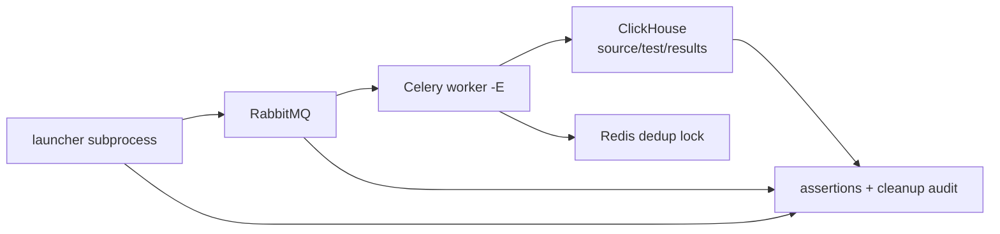

# Сквозные тестовые сценарии DDL Benchmark Engine

Статус: test design, 2026-07-31. Сценарии описывают проверку полного production-пути;
они ещё не реализованы как автоматический E2E suite.

Целевые state, identity и completion contracts, которые должны доказывать эти
сценарии, описаны в
[`TARGET_ARCHITECTURE_REFACTOR.md`](TARGET_ARCHITECTURE_REFACTOR.md).

Tier A/B/C ниже описывают риски и full path текущего ClickHouse+Celery runtime. После
clean-slate удаления они используются как requirements corpus, а новая автоматизация
строится вокруг Hatchet durable workflow/task tests и ClickHouse plugin TCK из target
RFC.

## 1. Цель и критерий «полного пути»

Полным считается путь, в котором настоящий launcher читает env, настоящий Celery
adapter публикует сообщения, отдельный worker выполняет SQL, а результаты и lifecycle
проверяются в настоящем ClickHouse:



Тест с fake adapter/store полезен, но не считается E2E: он не проверяет сериализацию,
broker delivery, worker lifecycle, Redis lock, реальный SQL и eventual consistency.

## 2. Текущее покрытие и пробел

Статически найдено 18 test modules и 359 test methods. Они хорошо покрывают модели,
DDL parser, генерацию, planner/runner, scoring и worker/result-store логику через
mocks/fakes. При этом в репозитории нет:

- `conftest.py` и pytest markers для `integration`/`e2e`;
- теста с настоящими ClickHouse, RabbitMQ и Redis;
- отдельного Celery worker в тесте;
- общего compose-файла для всего test stack;
- CI workflow, запускающего distributed сценарии.

`tests/test_main_mocked_runtime.py` проверяет композицию, но заменяет settings,
fetcher, result store и execution adapter, поэтому не закрывает production boundary.

## 3. Рекомендуемая test topology

Минимальный stack:

- ClickHouse: отдельные DB `e2e_source_<uuid>`, `e2e_test_<uuid>`,
  `e2e_results_<uuid>`;
- RabbitMQ: отдельный vhost и queue на test session;
- Redis: отдельный DB/prefix для locks;
- Celery worker `--pool=solo -E` для smoke и `--pool=prefork --concurrency=2 -E`
  для race/redelivery;
- launcher как subprocess с deadline и captured stdout/stderr;
- опционально Toxiproxy для сетевых fault-сценариев.

Не использовать production DB, queue или Redis prefix. Каждый тест получает UUID
namespace, а cleanup finalizer выполняется даже после падения assertion.

### 3.1 Детерминированная source fixture

Таблица `events` должна содержать как минимум:

- `event_id UInt64`;
- `event_time DateTime`;
- `user_id UInt64`;
- `country LowCardinality(String)`;
- `path String`;
- `revenue Nullable(Decimal(...))`.

Нужны повторяемые строки с hit/miss диапазонами и строковыми токенами. До запуска
фиксируются source DDL, `count()` и checksum; после теста они должны совпасть.

### 3.2 Общие fixtures/helpers

- `infra_stack` — readiness ClickHouse/RabbitMQ/Redis;
- `config_parts_factory(strategy=...)` — четыре JSON-секции + base64 env;
- `source_snapshot` — DDL/count/checksum до запуска;
- `expected_manifest` — ожидаемые jobs/modes из маленького golden config;
- `celery_worker_process(events=True, concurrency=...)`;
- `launcher_process(deadline=...)`;
- `result_rows_eventually(scope, expected)`;
- `rabbit_idle_eventually()`;
- `no_orphan_tables()`;
- `secret_canary` — пароль, который запрещено встретить в логах;
- `fault_proxy` — управляемое отключение сервисов.

## 4. Инварианты каждого E2E

Если сценарий явно не говорит обратное, после завершения должны выполняться все
условия:

1. source DDL/count/checksum не изменились;
2. result rows принадлежат только ожидаемому run/benchmark/table scope;
3. одна логическая execution identity даёт одну строку;
4. сохранённый DDL парсится `TableDDL.from_ddl()`;
5. baseline создан до variants и передан им;
6. queue не содержит ready/unacked сообщений, workers не имеют active/reserved tasks;
7. в test scope нет таблиц с `__bench__` или `__source_baseline__`;
8. секреты отсутствуют в launcher/worker logs и exception text;
9. любой wait имеет deadline; тест не может зависнуть бессрочно;
10. success означает заранее определённое terminal condition, а не только dispatch.

Cleanup query:

```sql
SELECT database, name
FROM system.tables
WHERE database = {test_database:String}
  AND (
      name LIKE '%__bench__%'
      OR name LIKE '%__source_baseline__%'
  );
```

## 5. Tier A: in-process contract path

В этом уровне настоящие settings/loader/planner/engine/runner/strategies; заменяются
только внешние ports. Он быстрый и запускается на каждый commit.

| ID | Сценарий | Ключевые проверки |
|---|---|---|
| IP-01 | Env bootstrap | четыре base64 секции, benchmark filter, result connection, test DB override, close hooks, secret-free logs |
| IP-02 | Матрица пяти strategies | baseline first, общий run/timestamp, source context во всех jobs, правильный mode/order |
| IP-03 | Config fail-fast | missing env, bad base64/JSON/reference/scoring/query не вызывают metadata/broker |
| IP-04 | Selectors и overrides | `*`, list/map, dedup, несколько connections, table-level priority |
| IP-05 | Query modes | manual/auto/mixed, placeholders, warm/cold, per-query operations, column-specific phased subsets |
| IP-06 | Baseline branches | success, empty source, timeout, exception, malformed/identity-mismatched result |
| IP-07 | Async boundary | regular = durable dispatch; sequential = terminal stage barrier; разные состояния названы явно |
| IP-08 | Resume | crash после N jobs, skip persisted, dispatch missing, completed table skipped, explicit run id priority |
| IP-09 | Stage correlation | stale/duplicate `execution_uuid`, failed summaries, timeout leaves incomplete state |
| IP-10 | Deterministic manifest | одинаковый config даёт одинаковые names/DDL/indexes, кроме execution UUID |
| IP-11 | Lifecycle failures | ошибки fetcher/store/baseline/dispatch/hooks не оставляют открытых scopes/resources |

## 6. Tier B: component integration

Каждый сценарий использует production component и настоящую внешнюю зависимость,
но не обязательно весь launcher-to-worker путь.

| ID | Компонент | Сценарий и acceptance |
|---|---|---|
| CI-01 | Fetcher + ClickHouse | `SHOW CREATE`, lists, column sizes, complex types/comments/indexes, auto-query sampling работают на реальной системной схеме |
| CI-02 | Worker + ClickHouse + Redis | прямой source/variant run создаёт положительные метрики, правильный score/result route и полностью очищает temp tables |
| CI-03 | Result schema | bootstrap, повторный bootstrap, migration старой схемы, legacy/phased routing, timezone, start/finish и ranking |
| CI-04 | Redis lock | два процесса пишут один execution UUID: одна row; collision/error/timeout и Redis-down ограничены и наблюдаемы |
| CI-05 | Adapter + RabbitMQ | source round-trip, variant publish, persistent queue, events, throttle, reconnect, reject-publish и `forget()` |
| CI-06 | Payload offload | ref-only broker message, load by worker, wrong kind/missing/malformed, strict/fallback mode и TTL |
| CI-07 | Failure persistence | invalid DDL/conversion/select/result insert failure дают failed/incomplete state и не оставляют table |
| CI-08 | SQL/ACL boundary | literals, comments, multi-statements, CTE, identifier injection и least-privilege users |
| CI-09 | Concurrent schema bootstrap | несколько worker processes одновременно создают/мигрируют result schema без DDL race |
| CI-10 | Ranking load | большой stage не создаёт неконтролируемую очередь synchronous ClickHouse mutations |

## 7. Tier C: real infrastructure E2E

### E2E-01 — `types_strategy` happy path

Given: одна непустая source table, isolated test/results DB, два type/codec candidates.

When: launcher запускается с production env и отдельным worker `-E`.

Then:

- launcher получает baseline и публикует ровно expected variants;
- baseline и type rows лежат в legacy result table;
- type/codec из manifest присутствуют в сохранённых DDL;
- после eventual completion выполнены все общие инварианты.

Отдельно фиксируется lifecycle contract: текущий launcher возвращается после dispatch,
поэтому assertion результатов должен сначала показать это различие, а после исправления
— проверять явный `DISPATCHED` либо terminal `SUCCEEDED` status.

### E2E-02 — `indexes_strategy` happy path

Проверить реальное создание skip-index, materialized index size, query metrics и
сохранённые `index_choices`. Физический index должен существовать во время замера,
но отсутствовать вместе с temp table после cleanup.

### E2E-03 — `combined_strategy` happy path

Golden config задаёт малое декартово произведение type/index/granularity. Число rows,
DDL combinations и `variant_mode=combined` должны точно совпасть с manifest.

### E2E-04 — `sequential_topn_strategy` happy path

Проверить barrier после types, реальный top-N по score и то, что index jobs построены
только от DDL выбранных type rows. Launcher не возвращается до terminal stage 2.

### E2E-05 — `sequential_phased_topn_strategy` happy path

Проверить rows с `variant_mode`:

`source_baseline`, `order_by`, `types`, `codecs`, `index_granularity`, `indexes`,
`final_validation`.

Acceptance:

- stages выполняются в этом порядке;
- `stage_column_name` есть у one-column stages;
- `merged_columns` есть у full-table stages;
- `parent_id`/`parent_variant_table` образуют существующий lineage;
- `rank_in_phase`, `is_top_n`, per-column rank/top-N согласованы;
- финальный winner имеет `variant_mode='final_validation'` и `is_top_n=1`;
- `benchmark_runs.finished_at IS NOT NULL` только после final winner.

Последнее условие является целевым: текущая стратегия может сделать early return и
всё равно быть помечена runner-ом как finished.

### E2E-06 — multi-scope run

Два benchmark IDs, несколько tables/connections, table override и отдельный result
connection. Фильтр launcher должен исключить всё вне выбранного scope; результаты
должны попасть только в result cluster.

### E2E-07 — empty source

Variant tasks отсутствуют, skip reason наблюдаем, phased lifecycle закрывается по
явной skip semantics, временных объектов и ложного final winner нет.

### E2E-08 — broker fault matrix

Проверить broker down/up до старта, restart между dispatch, queue overflow,
`reject-publish`, invalid credentials, source result timeout и worker без `-E`.
Retryable fault не теряет jobs; permanent fault завершается за заданный deadline.

### E2E-09 — worker lost и redelivery

Убить worker отдельно:

1. во время baseline insert;
2. после variant CREATE;
3. после measurements, но до result insert.

После redelivery ожидаются одна logical row и отсутствие orphan tables. Известный
риск: baseline получает случайный UUID внутри task, поэтому `SIGKILL` может оставить
старую table, которую повторная task не знает.

### E2E-10 — ClickHouse/OOM fault matrix

Остановить ClickHouse, ограничить memory отдельно для baseline/variant, запретить
INSERT в result table. Проверить row-limit reduction/retry, failed result и bounded
incomplete/error state.

### E2E-11 — Redis fault matrix

Redis down at bootstrap, down during insert, долгий lock holder и restart. Не должно
быть split-brain duplicates; failure должен быть fail-fast или явно recoverable.

### E2E-12 — phased resume после каждой стадии

После каждой стадии завершить launcher и запустить снова с resume.

Acceptance:

- продолжается тот же run;
- persisted variants не исполняются повторно;
- missing variants и следующие stages выполняются;
- completed run создаёт новый id;
- config drift либо отклоняется fingerprint check, либо начинает новый run.

Последний критерий сейчас не выполняется: run metadata не содержит config fingerprint.

### E2E-13 — resume при queued/in-flight task

Убить launcher, пока variant не записал result, и немедленно запустить resume. Одна
physical variant execution должна владеть table lease. Известный текущий риск:
resume видит только persisted names, повторно публикует job с новым `execution_uuid`,
а обе tasks используют одно имя и могут взаимно выполнить `DROP/CREATE`.

### E2E-14 — duplicate delivery

Один payload публикуется дважды двум workers. Ожидаются одна result row, корректные
metrics и отсутствие взаимного удаления physical table. Проверить duplicate до и
после первого result insert.

### E2E-15 — concurrent launchers

Одновременно запустить два launcher одного benchmark/table без explicit run id.

Целевой acceptance:

- run identities зарезервированы атомарно и различаются;
- physical temp names/leases различаются;
- rows и cleanup не пересекаются.

Сейчас ожидается воспроизведение дефекта: `max + 1` неатомарен, а имя variant table
не содержит run identity.

### E2E-16 — payload и SQL security

На sacrificial DB проверить tampered `variant_database`, arbitrary `variant_ddl`,
marker-like table в source DB, malicious payload ref, identifier injection, query
obfuscation и наличие secret canary в логах.

Целевой acceptance: подписанный/проверенный payload не может выйти за allow-listed
test/results DB; ClickHouse source user остаётся read-only. Текущий application guard
доверяет `variant_database` и DDL из того же payload, поэтому ACL является последней
линией защиты.

### E2E-17 — cleanup invariant sweep

Параметризовать happy/failure/timeout/kill сценарии и после каждого запускать orphan
sweep + source snapshot comparison. Для `SIGKILL` нужен отдельный reconciler/TTL;
обычный `finally` недостаточен.

### E2E-18 — result schema upgrade under load

Стартовать launcher и несколько workers на старой поддерживаемой схеме. Migration
должна выполняться контролируемо один раз, без `DROP/MODIFY` storm в каждой task и
без partial inserts.

### E2E-19 — large stage/backpressure

Сгенерировать сотни дешёвых jobs. Проверить bounded broker backlog/in-flight tasks,
скорость ranking, число ClickHouse mutations и отсутствие memory growth launcher/worker.

### E2E-20 — scoring directions and failure

Global `max`, stage-specific `min`, variables, per-query values и `on_error_score`.
Top-N должен соответствовать effective stage scoring; invalid expression обязана
остановить run до baseline. Failed/null candidate не может стать winner даже при
`top_selection=min`; all-invalid stage завершается `INCONCLUSIVE`.

### E2E-21 — source DDL safety matrix

Подать таблицы `MergeTree`, `ReplicatedMergeTree`, DDL с `ON CLUSTER`, TTL, storage
policy и неизвестной option.

Acceptance:

- безопасный local MergeTree проходит;
- replicated engine либо контролируемо переписан в isolated local engine, либо
  отклонён до dispatch;
- Keeper path/replica original table не переиспользуются;
- `ON CLUSTER` не исполняется worker-ом;
- original и effective benchmark DDL сохранены для аудита;
- cleanup не оставляет объектов на других nodes.

### E2E-22 — canonical sample equivalence и budget

Изменять live source параллельно run, вызвать adaptive OOM baseline и использовать
index candidate с empty/null values.

Acceptance:

- baseline и все variants читают один immutable sample ID/checksum;
- row count и row identity совпадают;
- source/tested aggregates для каждого job используют одинаковый query corpus hash;
- index path не применяет дополнительный фильтр данных;
- adaptive limit становится частью manifest и применяется всем jobs;
- превышение projected bytes/disk/time budget останавливает run до массового dispatch;
- score не рассчитывается для row mismatch.

### E2E-23 — rolling task protocol

Запустить комбинации new launcher/old worker и old launcher/new worker, затем task с
неподдерживаемой protocol version и payload, чей offload TTL истёк.

Acceptance:

- capabilities проверяются до run либо message идёт в version-compatible queue;
- unsupported/poison payload попадает в DLQ и durable FAILED state, а не Celery SUCCESS;
- task expiry строго меньше payload TTL;
- sanitized error не содержит connection secrets.

## 8. Матрица рисков и сценариев

| Риск | Обязательные сценарии |
|---|---|
| Concurrent table collision | E2E-13, E2E-14, E2E-15 |
| Неатомарный run id / unsafe resume | IP-08, E2E-12, E2E-15 |
| False success / неполный lifecycle | IP-07, IP-09, E2E-01, E2E-05, E2E-08 |
| Orphan tables | CI-07, E2E-09, E2E-17 |
| Distributed duplicates | CI-04, E2E-11, E2E-14 |
| Schema/ranking bottleneck | CI-03, CI-09, CI-10, E2E-18, E2E-19 |
| Credential/payload boundary | CI-06, CI-08, E2E-16 |
| Broker/event dependency | CI-05, E2E-08 |
| Unsafe copied DDL | CI-01, CI-02, E2E-21 |
| Несопоставимый/unbounded sample | CI-02, E2E-10, E2E-19, E2E-22 |
| Protocol drift / poison message | CI-05…CI-07, E2E-23 |

## 9. CI lanes и порядок внедрения

### На каждый commit — `unit`

- существующие 359 tests;
- IP-01…IP-11;
- deadline около 5 минут;
- без внешней сети.

### На pull request — `integration`

- CI-01…CI-09;
- E2E-01 и E2E-05 smoke;
- отдельные service containers;
- артефакты: launcher/worker logs, result rows, broker state, orphan query.

### Nightly/release — `e2e-chaos-security`

- E2E-01…E2E-23;
- prefork concurrency;
- broker/ClickHouse/Redis faults;
- повторы race-сценариев не менее 20 раз;
- ClickHouse version matrix.

Порядок P0: `types` smoke, phased smoke, safe-DDL preflight, canonical sample,
concurrent Redis idempotency, in-flight resume, worker kill/cleanup, concurrent
launchers, payload ACL и явный completion contract. Остальные strategies и
нагрузочные сценарии — P1/P2.

## 10. Диагностика падения

Каждый failed E2E должен сохранять:

- sanitized launcher/worker logs;
- effective config без passwords;
- run/table result rows и `benchmark_runs` snapshots;
- RabbitMQ queue/active/reserved state;
- список Redis lock keys только для test prefix;
- список temp/orphan tables;
- source before/after snapshot;
- timeline dispatch/event/result/cleanup.

Без этих артефактов distributed flake будет практически невоспроизводим.

## 11. Target Hatchet architecture spike

Эти сценарии не меняют legacy Celery runtime и не разрешают R0 deletion. Они являются
обязательным gate для production adoption Hatchet по
[`ADR-0001`](adr/0001-hatchet-orchestrator-trial.md).

Минимальная real-component topology:

- Hatchet API, Engine и optional Frontend отдельными deployments;
- PostgreSQL-only Hatchet transport, RabbitMQ отключён;
- product PostgreSQL database с отдельными role/migrations;
- durable-workflow worker и обычный I/O-task worker;
- deterministic toy plugin worker;
- Attempt/Resource API и independent Reaper;
- deny-all public Internet egress;
- hard limit `1 CPU / 1024 MiB` на каждый deployment/job.

### HAT-01 — resource envelope

Запустить idle, steady и burst profile на каждом компоненте. Зафиксировать cgroup
CPU, RSS/working set, OOM/restart count, PostgreSQL connections, queue delay и p95/p99
latency. Request/limit из Helm chart не считается измерением. Любой обязательный
deployment, который нельзя удержать в лимите без livelock/OOM, отклоняет Hatchet.

### HAT-02 — 100 active Studies и bounded admission

Создать 100 nonterminal Studies, но разрешить только несколько физических toy
attempts по отдельным profile/plugin/operation quotas. Проверить fairness,
backpressure и отсутствие source overload. 101-я submission получает явный
retryable `CAPACITY_EXHAUSTED` до создания Study, а не unbounded queue growth.

### HAT-03 — durable checkpoint replay

Durable task выполняет dynamic child-spawn/wait loop. Убить/evict worker после
каждого checkpoint и между checkpoints. После resume branch, child identities и
sealed snapshot hashes совпадают. DB/network/random access внутри durable code path
запрещается architecture test; side effects выполняют только child I/O tasks.

### HAT-04 — at-least-once I/O и fencing

Убить I/O worker до side effect, после side effect, после `CompleteAttempt` commit и
до ответа Hatchet. Повтор delivery может физически произойти, но остаётся ровно один
accepted result. Late fence не меняет current state и не удаляет resource новой
physical invocation.

### HAT-05 — cooperative cancellation и cleanup

Отменять Study во время wait, child spawn, ClickHouse query, materialization и
finalization. Проверить product `desired_state`, Hatchet cancellation signal,
best-effort backend cancel, fence invalidation и independent Reaper. Terminal
`CANCELLED` выводится из product transition, а не напрямую из Hatchet status.

### HAT-06 — exact A/B release routing

Начать Study на core/plugin release A, затем поднять B и начать новый Study. Releases
регистрируют разные versioned action names. Старый Study и cleanup используют только
A; новый — только B. Удаление A до terminal/cleanup запрещено. Worker affinity labels
могут быть дополнительным фильтром, но не единственной correctness boundary.

### HAT-07 — component outage matrix

По отдельности перезапустить Hatchet API, Engine, Hatchet PostgreSQL, product
PostgreSQL, durable worker и I/O worker. Проверить documented resume/fail-closed
behavior, отсутствие потерянных outbox commands и reconciliation случая «Hatchet
completed, terminal business outcome отсутствует».

### HAT-08 — bounded continuation

Сгенерировать многораундовый search, превышающий один bounded run. Current run
seal-ит snapshot, atomically создаёт successor command с `continuation_no` и previous
snapshot hash, затем завершается. Successor не дублирует logical jobs. Измеряются
Hatchet checkpoint/event/payload sizes; рост должен иметь заданную верхнюю границу.

### HAT-09 — blocked-egress full path

Из внутреннего bundle/registry выполнить installation, migrations, startup, login в
operator UI, toy workflow, backup и restore при deny-all public egress. Проверить, что
нет DNS/connect attempts к `security.hatchet.run`, public registries, telemetry,
OAuth, SMTP, fonts/scripts/CDN и update endpoints.

### HAT-10 — authority и product UI boundary

Намеренно создать рассинхронизации Hatchet state и product projection. CLI/status
API обязаны читать PostgreSQL business projection, показывая Hatchet IDs только как
correlation. Hatchet `completed` без terminal business commit не является success.
Hatchet Frontend остаётся operator-only и не заменяет Control API.

Spike получает `PASS` только при green HAT-01…HAT-10 с сохранёнными resource traces,
sanitized logs, PostgreSQL snapshots и exact image/config digests. Иначе ADR-0001
supersede-ится до production implementation; параллельный fallback runtime не
добавляется.

Фактический статус первого M0 прогона и список оставшихся доказательств находятся в
[`M0_HATCHET_SPIKE_REPORT.md`](M0_HATCHET_SPIKE_REPORT.md).
